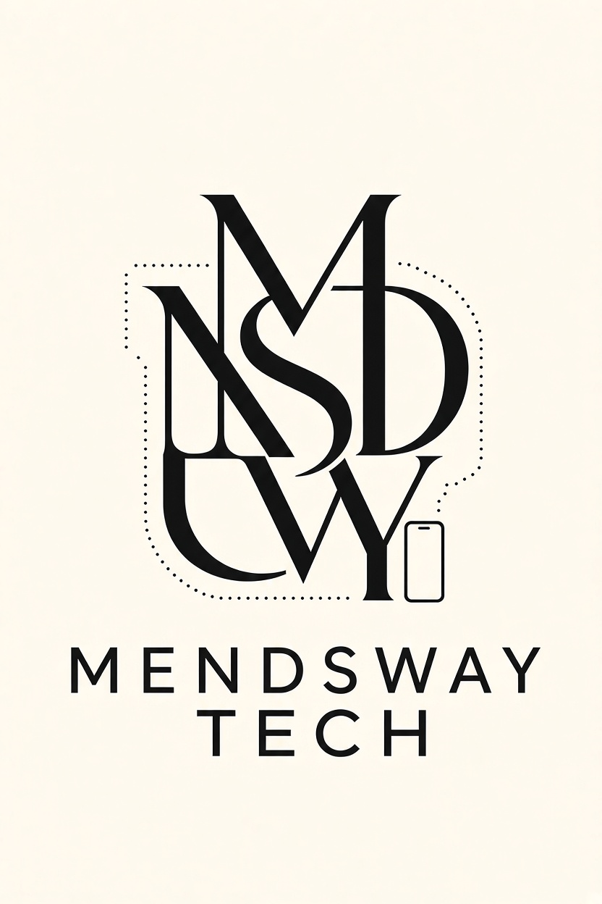

# MendsWay Tech — Full Luxury Theme (Android 17 Ready)

Same attached picture → APK launcher icon + splash + in-app hero.



## What was built
Full Material 3 theme app (`com.mendsway.tech.theme`):
- **Light**: ivory paper `#FEF9EE` / ink `#141414` / sand `#EDE5D3`
- **Dark**: warm charcoal `#12110E` / champagne `#F2EAD8`
- **Accent**: gold `#C9A86A` (luxury complement to the B/W logo)
- **Type**: serif display (monogram voice) + letterspaced sans body (matches “MENDSWAY TECH”)
- **Shapes**: 8→32dp rounded luxury cards
- **Screens**: Home (hero) / Theme (swatches+type) / Components (M3 showcase) / Brand (wallpaper + icon info)
- **Dynamic color** toggle (Android 12+; on Android 17 picks up wallpaper tones)

## Same picture as APK picture
- `app/src/main/res/drawable-nodpi/mendsway_brand.jpg` = attached logo (hero + splash source + wallpaper)
- `mipmap-{mdpi…xxxhdpi}/ic_launcher.png` + `ic_launcher_round.png` = full picture on ivory (legacy)
- `mipmap-anydpi-v26/ic_launcher.xml` = adaptive icon:
  `background @color/ic_launcher_background (#FEF9EE)` +
  `foreground @mipmap/ic_launcher_foreground (monogram crop)` +
  `monochrome @mipmap/ic_launcher_monochrome` → **Android 13+ themed icons**
- `drawable/ic_brand_splash.xml` + `Theme.MendsWay` splash → logo on launch

## Android 17 support
- `compileSdk 36 / targetSdk 36 / minSdk 26` — installable and behavior-correct on **API 37 (Android 17)** devices (forward-compatible, Play-ready stable; AGP 8.7.3 is tested to 35, 36 builds with warning)
- `enableEdgeToEdge()` + `windowOptOutEdgeToEdgeEnforcement=false` (15/16/17 enforcement)
- `android:enableOnBackInvokedCallback=true` (predictive back)
- Themed icon (API 33+), `localeConfig` per-app language (API 33+), SplashScreen (API 31+ compat)
- Runtime `POST_NOTIFICATIONS` + `READ_MEDIA_IMAGES` (API 33+), `READ_EXTERNAL_STORAGE maxSdk 32`
- `exported=true` launcher activity, adaptive configs, RTL support

> To literally compile against the Android 17 beta SDK: set `compileSdk = 37`, `targetSdk = 37`, AGP ≥ 8.9, build-tools `37.0.0`, and re-run. No app-code changes needed.

## Build
```bash
cd mendsway-theme-app
./gradlew :app:assembleDebug
# APK → app/build/outputs/apk/debug/app-debug.apk
# copy → release/MendsWay-Tech-theme-debug.apk
```

Install: `adb install -r release/MendsWay-Tech-theme-debug.apk` (package `com.mendsway.tech.theme.debug`).

## Layout
```
mendsway-theme-app/
  brand/mendsway_original.jpg     # attached source
  release/MendsWay-Tech-theme-debug.apk
  app/src/main/
    AndroidManifest.xml
    java/com/mendsway/tech/theme/MainActivity.kt
    java/com/mendsway/tech/theme/ui/theme/{Color,Type,Theme}.kt
    res/drawable-nodpi/mendsway_brand.jpg
    res/mipmap-*/ic_launcher*.png
    res/mipmap-anydpi-v26/ic_launcher*.xml
    res/values/{colors,strings,themes}.xml
```
